# 🎉 Data Collection System - Ready for Jersey Number Training!

## ✅ What We've Built

### 📱 **Android App Features:**
- **📸 Data Collection Mode**: New "Collect" tab in camera interface
- **Manual Annotation**: Tap jersey numbers → annotation dialog → training sample
- **Auto-Collection**: Automatically captures high-confidence ML Kit detections
- **Dataset Statistics**: Real-time tracking of collected samples
- **Metadata Capture**: Lighting, distance, angle conditions for each sample

### 🧠 **Custom ML Infrastructure:**
- **`CustomJerseyDetectionAnalyzer.kt`**: TensorFlow Lite detection engine
- **`JerseyDetectionManager.kt`**: Smart fallback system (Custom model ↔ ML Kit)
- **`JerseyDatasetCollector.kt`**: Real-time data collection and YOLO export
- **Performance monitoring**: Automatic quality assessment and model switching

### 🐍 **Training Pipeline:**
- **Complete training script** with YOLO-style architecture
- **Data augmentation** for sports scenarios (motion blur, lighting, angles)
- **TensorFlow Lite conversion** for mobile deployment
- **Dataset export** in YOLO format for established training frameworks

## 🚀 How to Start Data Collection

### 1. **Setup Training Environment (One-time)**
```bash
cd ml_training
./setup.bat  # Windows
# or ./setup.sh  # Linux/Mac
```

### 2. **Install Updated App**
```bash
# The app is already built with data collection features
adb devices  # Make sure device is connected
adb install -r app-debug.apk
```

### 3. **Start Collecting Data**
1. Open PlayerID app
2. Go to Camera tab
3. **Switch to "📸 Collect" mode** (new button)
4. **Manual Collection**: Tap on jersey numbers → fill annotation dialog
5. **Auto Collection**: Enable checkbox to auto-capture ML Kit detections

### 4. **Data Collection Strategy**
```
📊 Target: 1,000+ samples minimum (5,000+ optimal)

Priority Collection:
├── Numbers 1-50 (most common): 70% of samples
├── Numbers 51-99: 25% of samples  
└── Special (0, 00): 5% of samples

Scenario Coverage:
├── Lighting: 40% normal, 30% bright, 30% dark
├── Distance: 50% medium, 30% close, 20% far
└── Angles: 60% front, 25% angled, 15% side
```

## 📊 Data Collection Interface

### **Camera Screen Modes:**
- **Auto**: Enhanced ML Kit detection (existing)
- **Manual**: Tap-to-place bubbles with tracking (existing) 
- **📸 Collect**: NEW - Data collection mode with annotation

### **Collection Features:**
- **Tap Annotation**: Tap jersey → annotation dialog → sample saved
- **Auto-Capture**: Toggle to auto-collect high-confidence detections
- **Live Statistics**: See total samples collected in real-time
- **Metadata Tracking**: Each sample tagged with conditions

### **Annotation Dialog:**
- Jersey number input (0-99)
- Lighting condition (bright/normal/dark)
- Distance (close/medium/far)  
- Camera angle (front/side/angled)

## 🎯 Path to >80% Accuracy

### **Phase 1: Initial Data Collection** (This Week)
- **Target**: 1,000+ diverse samples
- **Focus**: Common jersey numbers in varied conditions
- **Method**: Manual annotation + auto-collection

### **Phase 2: Model Training** (Next Week)
```bash
# Train initial model
python train_jersey_detector.py --data ./data --epochs 50

# Convert to mobile format
python convert_to_tflite.py --model jersey_detector.h5
```

### **Phase 3: Deployment & Testing** (Following Week)
- Copy trained model to `app/src/main/assets/jersey_detector.tflite`
- Test >80% accuracy in real conditions
- Iterate based on performance

### **Phase 4: Production Optimization** 
- Optical flow tracking integration
- Model compression and optimization
- Performance monitoring and auto-updates

## 💡 Pro Tips for Data Collection

### **Quality Over Quantity:**
- Clear, unambiguous jersey numbers
- Accurate bounding box annotations
- Diverse real-world conditions

### **Efficient Collection:**
- Start with games/practices (multiple players visible)
- Use auto-collection during normal app usage
- Focus on common jersey numbers first (1-50)

### **Balanced Dataset:**
- Collect across different sports
- Various lighting conditions (indoor/outdoor)
- Multiple camera distances and angles

## 🔄 Training Workflow

```mermaid
graph TD
    A[📸 Collect Samples] --> B[📊 Dataset: 1000+ samples]
    B --> C[🧠 Train Custom Model]
    C --> D[📱 Deploy to Android]
    D --> E[🎯 Test >80% Accuracy]
    E --> F{Meets Goal?}
    F -->|Yes| G[🚀 Production Ready!]
    F -->|No| H[📈 Collect More Data]
    H --> C
```



## 🎉 Ready to Begin!

The data collection system is **live and ready**. Connect your device, install the app, and start collecting jersey number samples. The path to >80% detection accuracy begins with quality training data!

**Next action**: Switch to "📸 Collect" mode and start tapping jersey numbers! 🏆